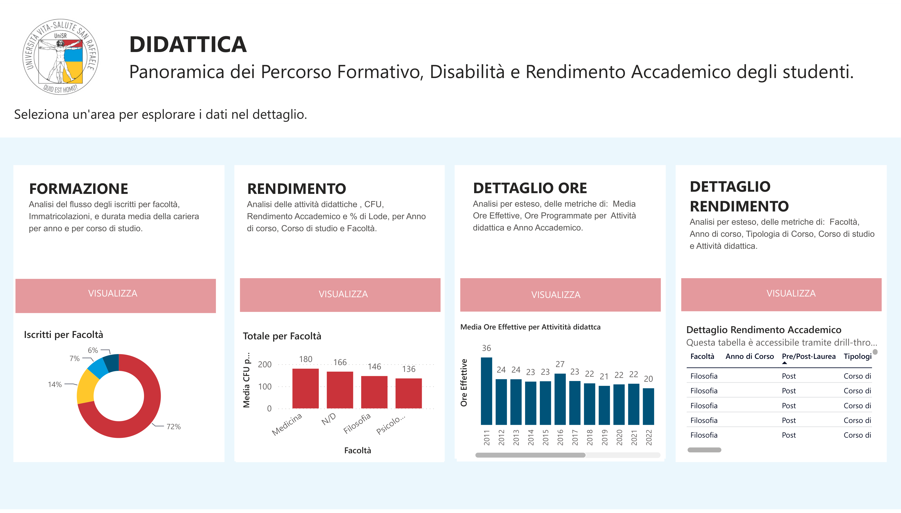
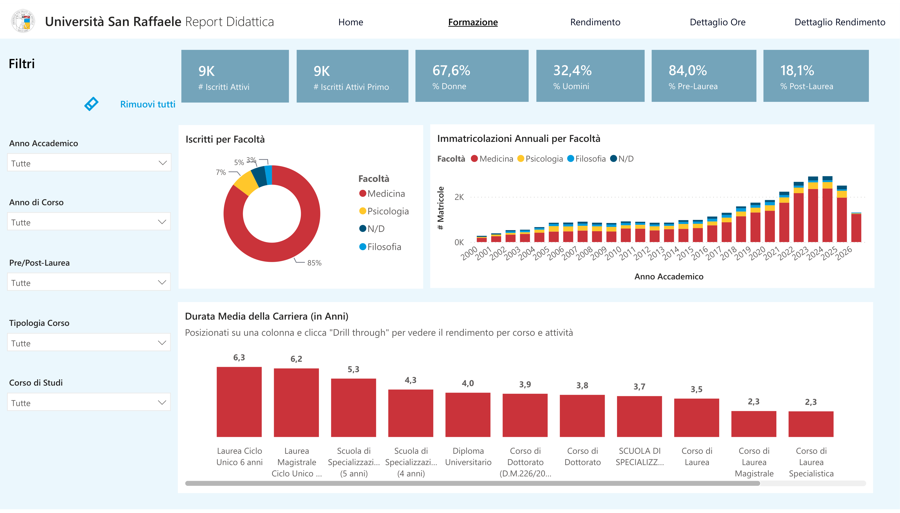

# 5.5 Power BI implementation

The semantic model and the KPIs described in Sections 5.3 and 5.4 are consumed by a set of Power BI reports that expose the analytical output of the project to academic management. This section describes how the reports are organised, how the interaction with the data is structured across pages, and how the reports are distributed to the users through Power BI Service.

## 5.5.1 Report organisation

The Business Intelligence solution is not delivered as a single monolithic report. It is organised as an application that groups six thematic reports, each built on its own semantic model: `Report_Didattica` for student careers and academic performance, `Report_Servizi_Studenti` for student services, `Report_Ammissioni` for admissions, `Report_Amministrazione_Finanza` for administration and finance, `Report_Accreditamento_Qualità` for accreditation and quality, and `Report_Frequenze_Aule` for attendance and classrooms. This organisation was preferred over a single-report design for three reasons: it aligns the boundary of each report with a well-defined semantic model, it keeps the maintenance surface of each report contained, and it allows the differentiation of access rights across audiences to be applied at the level of the individual report rather than at the level of the pages of a shared one.

The report at the centre of this thesis is `Report_Didattica`, which corresponds to the student careers domain. It is built on the semantic model documented in Section 5.3 and consumes the KPIs catalogued in Section 5.4. Its pages are organised around the thematic families of the KPI catalogue: pages dedicated to enrolment and population, pages dedicated to academic performance, and pages dedicated to attendance and risk monitoring. The families beyond the direct focus of the thesis (didactic organisation, teaching staff, classrooms) are covered in the KPI catalogue and, where relevant, in the other reports of the application, and are not analysed in detail here, consistently with the scope delimitation stated in Section 4.5.

## 5.5.2 Interaction patterns across pages

The pages of the report follow one of two complementary interaction patterns, depending on the nature of the management question they support.

The first pattern is the *standing overview*. A standing overview page displays a curated set of KPIs at the aggregated level, typically for the entire institution or for a selected study programme, with slicers that allow the user to change the temporal or the categorical context (academic year, cycle, gender). The user reads the page as a periodic snapshot of the domain, without navigating further. This pattern is applied to the pages that summarise the state of enrolment and of academic performance at the institutional level, where the primary question of the management is one of ongoing monitoring rather than of investigation.

The second pattern is *overview with drill-down*. A drill-down page starts from the same kind of aggregated view but provides visuals through which the user can navigate to a finer grain: from the institution to the study programme, from the study programme to the cohort, and where relevant from the cohort to the individual student. This pattern is applied selectively, on the pages where the management question typically requires the identification of specific cases behind an aggregated indicator (for example, the identification of the students in the yellow or red risk band of the `Fascia Studente CdS` KPI). The drill-down was not applied to every page of the report as a default, in order to keep the pages that serve a monitoring purpose visually simple and fast to consult.

## 5.5.3 Distribution and access model

The reports are published to the Power BI Service and grouped into a single Power BI application that is made available to the client. From the perspective of the user, the application is the entry point to the whole Business Intelligence solution: a single interface from which each thematic report can be opened, without the user having to be aware of the underlying separation into distinct files.

Access to the application is differentiated by user role. The three main audiences configured for the project are the rectorate, whose members have access to the institutional-level views across all domains; the study programme directors, whose access is oriented towards the reports and the pages relevant to didactic and academic performance monitoring; and the administrative offices (student registrar and didactic services), whose access is oriented towards the operational reporting relevant to their functions. The differentiation is defined at the level of the report and of the audience within the application, so that a change in the role of a user is applied by updating the group membership rather than by rebuilding the report.

The refresh cadence of the reports is aligned with the refresh cadence of the underlying gold layer (Section 5.3), configured with a target lag of one day. In practical terms, the users of the application see a version of the data that reflects the state of the source systems at the end of the previous day. This cadence matches the analytical needs of academic management, whose decisions on student careers do not require sub-daily latency.

## 5.5.4 Contribution to the research question

Read against the four dimensions of "improvement" introduced in Section 4.4, the Power BI implementation described in this section contributes to three of them. The publication of the reports on the Power BI Service, together with the daily refresh, provides *standing visibility*: the reports exist as a persistent artefact that the user can consult when needed, rather than as a one-off answer produced on request. The organisation of the reports into an application with differentiated access aligns the *distribution of technical dependency* with the distribution of decisional responsibility, so that the user who consults a report does not need to interact with the IT department to obtain the information. The interaction patterns described in Section 5.5.2, in particular the selective drill-down, contribute to *self-service exploration*: within the boundaries of what the report designer has enabled, the user can refine a question without initiating a new request. The fourth dimension, *consistency and governance*, is addressed structurally by the semantic model discussed in Sections 5.3 and 5.4, and is preserved end-to-end by the fact that all the reports consume the same governed set of KPIs.

---

## [TO CONFIRM] for this section

1. RESOLVED — six thematic reports, from the Power BI workspace: `Report_Didattica`, `Report_Servizi_Studenti`, `Report_Ammissioni`, `Report_Amministrazione_Finanza`, `Report_Accreditamento_Qualità`, `Report_Frequenze_Aule`.
2. RESOLVED — the author confirmed the use of the real report names; they are now used in the text.
3. **Page names** — I describe pages by their thematic family ("pages dedicated to enrolment and population") without naming them. Do the actual pages of the report have specific titles I should mention?
4. **Drill-down implementation** — I describe the pattern as institution → programme → cohort → student. Is that the actual navigation path, or is it different (e.g. programme → year → student, without cohort intermediate)?
5. **Access rights mechanism** — I wrote "audience within the application", which is how Power BI apps typically implement role-based access. Is that actually how it's configured, or is it via workspace roles / Azure AD security groups / row-level security? Important because it determines the technical accuracy of the paragraph.
6. **Refresh cadence** — I re-stated "target lag of one day" consistent with §5.3. Verified?
7. **Slicers list** — I mention "academic year, cycle, gender" as example slicers. Are these actually the main slicers used on the enrolment pages, or should I generalise ("temporal and categorical slicers")?
